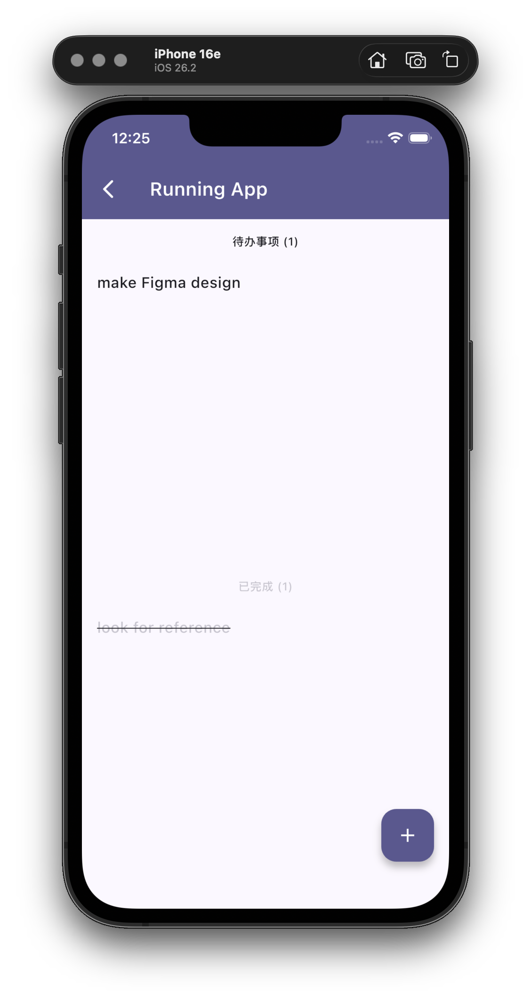

# Todo Flutter Clean Architecture


A modern Flutter todo application demonstrating clean architecture principles with reactive state management using Isar database.

## Overview

This project showcases a production-ready Flutter application with:
- **Clean Architecture** - separation of concerns with Repository pattern
- **Reactive Streams** - real-time UI updates using Isar's built-in watch functionality
- **Provider Pattern** - efficient state management with ChangeNotifier
- **Isar Database** - high-performance local storage with type safety

## Architecture

```
┌─────────────────────────────────────────────────────────┐
│                   Presentation Layer                     │
│  (Pages, Widgets, UI Components)                         │
└────────────────────┬────────────────────────────────────┘
                     │
┌────────────────────▼────────────────────────────────────┐
│                   Provider Layer                         │
│  (ProjectProvider, TodoProvider - State Management)      │
└────────────────────┬────────────────────────────────────┘
                     │
┌────────────────────▼────────────────────────────────────┐
│                  Domain Layer                            │
│  (Repositories, Entities, Business Logic)                │
└────────────────────┬────────────────────────────────────┘
                     │
┌────────────────────▼────────────────────────────────────┐
│                   Data Layer                             │
│  (Repository Implementation, Isar Database)              │
└─────────────────────────────────────────────────────────┘
```

## Tech Stack

- **Framework**: Flutter
- **Language**: Dart 3.0+
- **State Management**: Provider
- **Database**: Isar Community (NoSQL with type safety)
- **Routing**: GoRouter
- **Architecture**: Clean Architecture + Repository Pattern

## Key Features

### Reactive State Management
- Real-time updates using Isar streams
- Automatic UI rebuilds on data changes
- Memory efficient with proper subscription management

### Project & Todo Management
- Create, read, update, delete projects
- Organize todos within projects
- Track completion status
- IsarLinks for type-safe relationships

### Clean Separation of Concerns
- **Domain Layer**: Abstract repositories and business entities
- **Data Layer**: Repository implementations with Isar integration
- **Presentation Layer**: UI components with Provider integration

## Project Structure

```
lib/
├── domain/
│   ├── entity/              # Business entities
│   │   ├── project_entity.dart
│   │   └── todo_entity.dart
│   └── repositories/        # Abstract interfaces
│       ├── project_repository.dart
│       └── todo_repository.dart
├── data/
│   └── repository/          # Concrete implementations
│       ├── project_repository_impl.dart
│       └── todo_repository_impl.dart
├── provider/               # State management
│   ├── app_initializer.dart
│   ├── project_provider.dart
│   └── todo_provider.dart
├── pages/
│   ├── projects/           # Project screens
│   └── todos/              # Todo screens
├── router/                 # Navigation
│   └── app_router.dart
└── main.dart
```

## Screenshots

### Projects Screen


### Todo Details Screen


## Getting Started

### Prerequisites
- Flutter 3.0+
- Dart 3.0+

### Installation

1. Clone the repository
```bash
git clone https://github.com/yourusername/todo-flutter-clean.git
cd todo-flutter-clean
```

2. Install dependencies
```bash
flutter pub get
```

3. Generate Isar database models
```bash
dart run build_runner build
```

4. Run the app
```bash
flutter run
```

## Data Flow

### Create Todo Flow
```
UI (CreateTodoSheet)
    ↓
TodoProvider.createTodo()
    ↓
TodoRepositoryImpl.addTodo()
    ↓
Isar.writeTxn() [Database Update]
    ↓
Stream.watchTodosByProject() [Triggers Update]
    ↓
TodoProvider [notifyListeners()]
    ↓
UI Rebuilds [ListView Updated]
```

## Key Concepts

### Reactive Streams
- Database changes trigger automatic UI updates
- No manual state refresh needed
- Efficient resource management with subscription cleanup

### IsarLinks
- Type-safe relationships between entities
- Bidirectional sync between collections
- Automatic persistence of relationships

### Provider Pattern
- Centralized state management
- Automatic disposal of resources
- Clean separation from UI logic

## License

This project is licensed under the MIT License - see the LICENSE file for details.

## Author

Created as a demonstration of clean architecture principles in Flutter.
